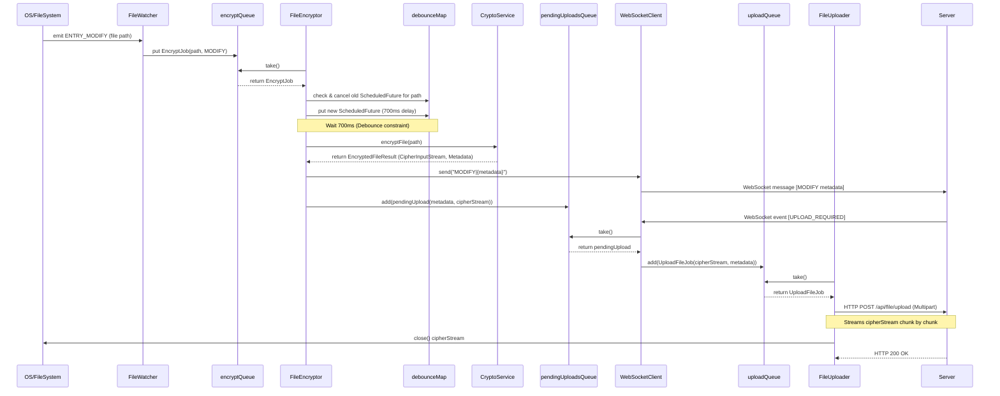
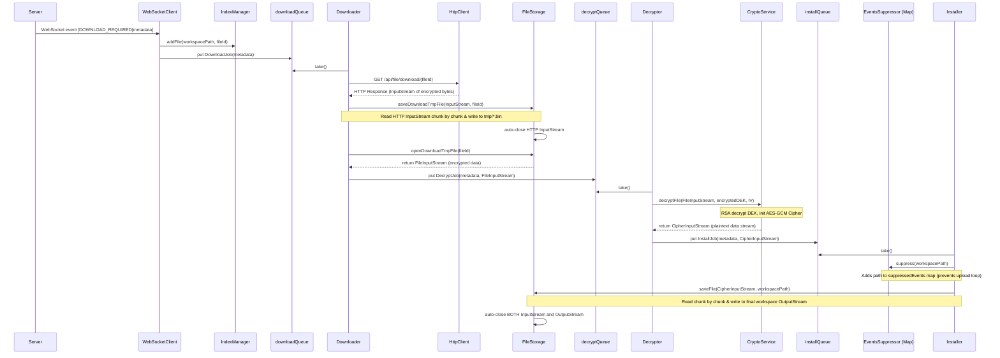
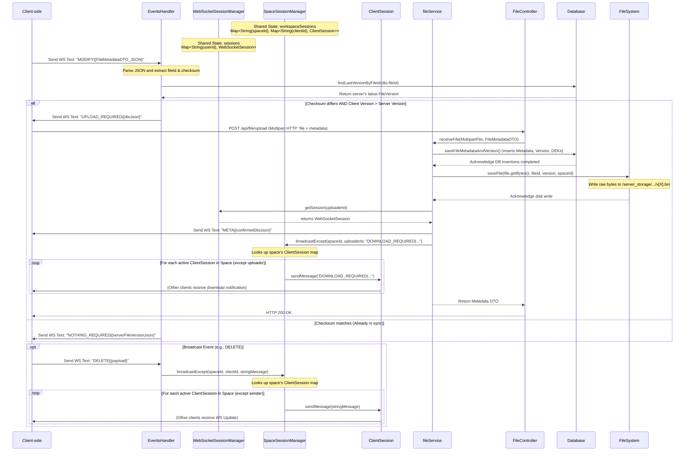

## Index

- [Problem](#problem)
- [What the system does](#what-the-system-does)
    - [Overview (what the system does)](#overview-what-the-system-does)
    - [How users interact with it (setup)](#how-users-interact-with-it)
- [Technical challenges](#technical-challenges)
    - [Encryption model](#encryption-model)
    - [Key management](#key-management)
    - [File streaming](#file-streaming)
    - [Client-side concurrency model](#client-side-concurrency-model)
- [Architecture decisions](#architecture-decisions)
- [What I’d improve (trade-offs)](#what-id-improve-trade-offs)

## Problem

Most file-sharing systems require trusting the server with your data. I wanted to design a system where even the server cannot read user files.

## What the system does

### Overview (what the system does)

Users play with files → encrypted locally → sent to server → downloaded on space’s users’ devices → decrypted by space’s users’ devices

#### client-side upload pipeline sequence diagram



#### client-side download pipeline sequence diagram



#### server-side file sync flow with message protocol sequence diagram



### How users interact with it ( setup )

1. prerequirements
- maven

### 1. Run the client

```
git clone https://github.com/karim05hosni/E2EE_file_sync.git
cd E2EE_file_sync/client-app/client-app
mvn clean compile
mvn exec:java -Dexec.mainClass="com.karimhosny.Main"
```

---

### Run the server

Check E2EE_file_sync/filesyncserver/README.md

### 2. First-Time Setup (Onboarding)

On the first run, the client will guide you through initial setup:

- You will be prompted to enter a **base directory** for your workspace.
- This directory will contain:
    - your files (`workspace/`)
    - encrypted versions (`ciphertext/`)
    - metadata (`metadata/`)
    - keys (`keys/`)
- you will be asked for config file id, if you want to test on two clients, you can run the same instance but input two different config file id, this is where base directory get stored

---

### 3. Configuration File

After setup, a `config.json` file will be created in the application directory:

```
{
  "baseDirectory":"/your/path/here"
}
```

This file is used to persist your configuration for future runs.

---

### 4. Key Generation

During setup:

- A **public/private key pair** is generated on your device.
- Your **private key is encrypted** using a User Master Key (UMK).
- The **public key is sent to the server**.
- Keys are stored in:

```
<baseDirectory>/keys/
```

---

### 5. Directory Structure

After setup, your base directory will look like:

```
client_storage/
├── workspace/      # Your editable files
├── ciphertext/     # Encrypted versions (synced with server)
├── metadata/       # File index and checksums
├── keys/           # Encrypted private key + public key
└── temp/           # Temporary files
```

---

### 6. Running After Setup

On subsequent runs:

- The client loads `config.json`
- Decrypts your private key using UMK
- Starts monitoring your workspace for changes
- Automatically syncs files with the server

### ⚠️ Notes

- Do not manually modify files inside `ciphertext/` or `metadata/`.
- Deleting the `keys/` directory will result in loss of access to encrypted files.
- Ensure your base directory has sufficient storage for file versions.

## Technical challenges

### Key management

user keys: 

- UMK: its parameters are stored locally, on app startup, the parameters get loaded and user enters his password to derive UMK. used for encrypting and decrypting user’s private key
- RSA Private Key: stored encrypted locally, on app startup, it gets loaded and derived from UMK
- RSA Public key: stored on server

each file has versions, each version has a Data Encryption Key “DEK” which is a AES symmetric key, that is stored on postgres encrypted by users’ public keys

### Encryption model

Each file version is encrypted by “DEK”, it’s stored on server encrypted with all space users’ public keys so that it can be decrypted only by space users’ private keys

### File streaming

upload pipeline:

FileEncryptor worker opens file stream by triggering CryptoService.encryptFile(filePath) by Files.newInputStream(filePath).

FileUploader worker closes it after upload the encrypted file to server over HTTP multipart request.

download pipeline:

FileDownloader opens it after downloading the encrypted file from server “executing DownloadJob” by fileStorage.saveDownloadTmpFile().

FileInstaller closes it after writing to user’s final workspace by fileStorage.saveFile().

the standard streaming interface used is InputStream, since it doesn’t load all the file once in memory but only chunk-by-chunk

### Client-side concurrency model

it’s mainly consists of Upload pipeline & Download pipeline, each has workers running concurrently with relying on producer-consumer pattern with mechanisms that decrease the common backpressure problem in that design

```mermaid
flowchart TD

    subgraph Upload Pipeline
        FW[FileWatcher]
        EQ[("encryptQueue<br/>(LinkedBlockingQueue)")]
        FE[FileEncryptor]
        DebMap[("debounceMap<br/>(ConcurrentHashMap)")]
        PUQ[("pendingUploadsQueue<br/>(LinkedBlockingQueue)")]
        UQ[("uploadQueue<br/>(LinkedBlockingQueue)")]
        FU[FileUploader]
        WS[WebSocketClient]
        Srv((Server))

        FW -- "put EncryptJob(path, action)<br/>raw file change event" --> EQ
        EQ -- "take EncryptJob()" --> FE
        FE <--> |"check/update ScheduledFuture<br/>coalesces rapid file edits"| DebMap
        
        FE -- "put pendingUpload(meta, cipherStream)<br/>holds stream until server approval" --> PUQ
        FE -- "put UploadMetadataJob / UploadFileJob" --> UQ
        
        WS -- "takes pendingUpload upon<br/>UPLOAD_REQUIRED msg" --> PUQ
        WS -- "transforms pending to UploadFileJob" --> UQ
        
        UQ -- "take UploadJob()" --> FU
        FU -- "streams chunked HTTP POST" --> Srv
    end

    subgraph Download Pipeline
        Srv2((Server))
        WS2[WebSocketClient]
        DQ[("downloadQueue<br/>(LinkedBlockingQueue)")]
        DL[Downloader]
        DecQ[("decryptQueue<br/>(LinkedBlockingQueue)")]
        Dec[Decryptor]
        IQ[("installQueue<br/>(LinkedBlockingQueue)")]
        Inst[Installer]
        ESMap[("suppressedEvents<br/>(ConcurrentHashMap)")]

        Srv2 -- "[DOWNLOAD_REQUIRED|metadata]" --> WS2
        WS2 -- "put DownloadJob(metadata)" --> DQ
        DQ -- "take DownloadJob()" --> DL
        
        DL -- "downloads HTTP to tmp,<br/>put DecryptJob(metadata, stream)" --> DecQ
        DecQ -- "take DecryptJob()" --> Dec
        
        Dec -- "decrypts chunk stream,<br/>put InstallJob(metadata, plainStream)" --> IQ
        IQ -- "take InstallJob()" --> Inst
        
        Inst -- "put(path, timestamp)<br/>skips FileWatcher loop" --> ESMap
        Inst -- "writes plaintext to workspace" --> Workspace[(Workspace FS)]
    end
```



## Architecture decisions

### Tech Stack:

- Java: due to the strengths of it’s libraries in cryptographic operations and concurrency models
- postgresql:  for storing files metadata and users’ public keys in a structured relational schema
- spring-boot: the main Java framework for server-side applications and it’s libraries that handles websocket protocol perfectly, making it ideal for event-drive systems

## What I’d improve (trade-offs)

- Error handling on threads interruptions, cryptographic operations failures and corrupted websocket messages
- Focus was on architecture and learning not full security hardening, it would be mandatory to perform security audit before going on production
- key management is simplified and not production grade, e.g user’s keys needs recovery mechanism
- some things were not taken in considerations since I already learnt what I wanted e.g renaming files, encrypting user’s file path, scheduling tasks that handles thread interruptions, file sync failures on different levels in the pipeline, connection recovery with the server and closing the idle opened file streams
- cleaning the messy functions